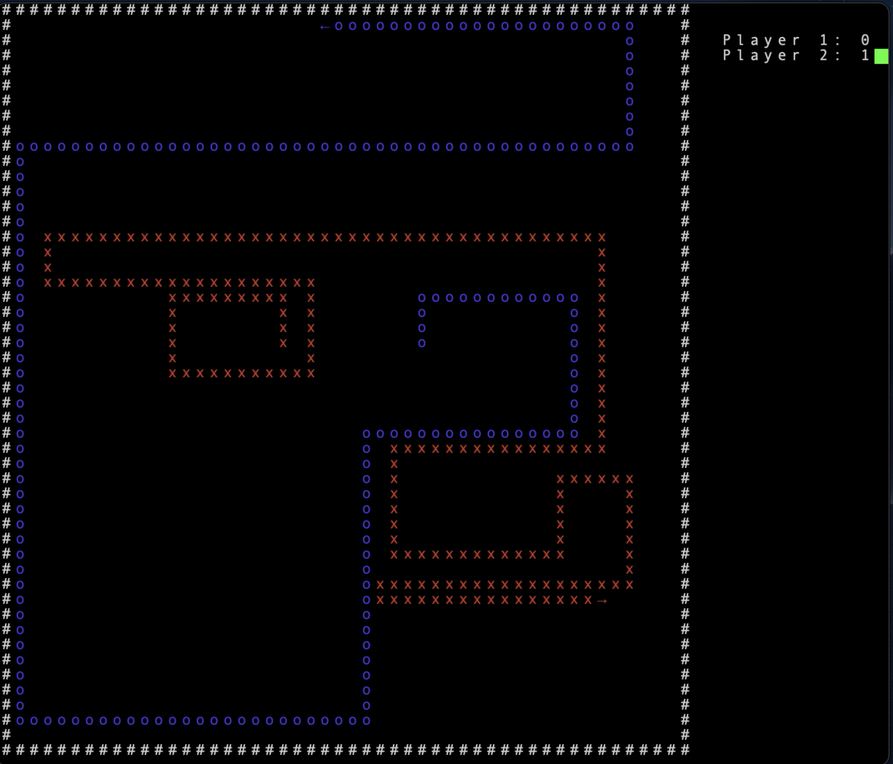

# Haskade

## Background
This is an implementation of the classic 2-player arcade game Blockade released by Gremlin in 1976. Here is a [video](https://www.youtube.com/watch?v=5v-0CwiabZA) that shows the original.

## Dependencies
To run the game you need GHC and an installation of ncurses. If you have GHC installed you can run the command `cabal intsall ncurses` to get ncurses and all its dependencies.

## How to run
Clone the repository and navigate to the folder. Entering the command `runhaskell Main.hs` will start the game.

## Controls
#### Player 1 (Red): W, A, S, D
#### Player 2 (Blue): I, J, K, L
You can press ESC to exit the game.

## Rules:
Any time a player collides with a wall, himself or the other player, the other player gets a point. The first player to reach 5 points wins the game.

## Gameplay
Video: https://youtu.be/Tu2WTAAoz8s

### Screenshot

